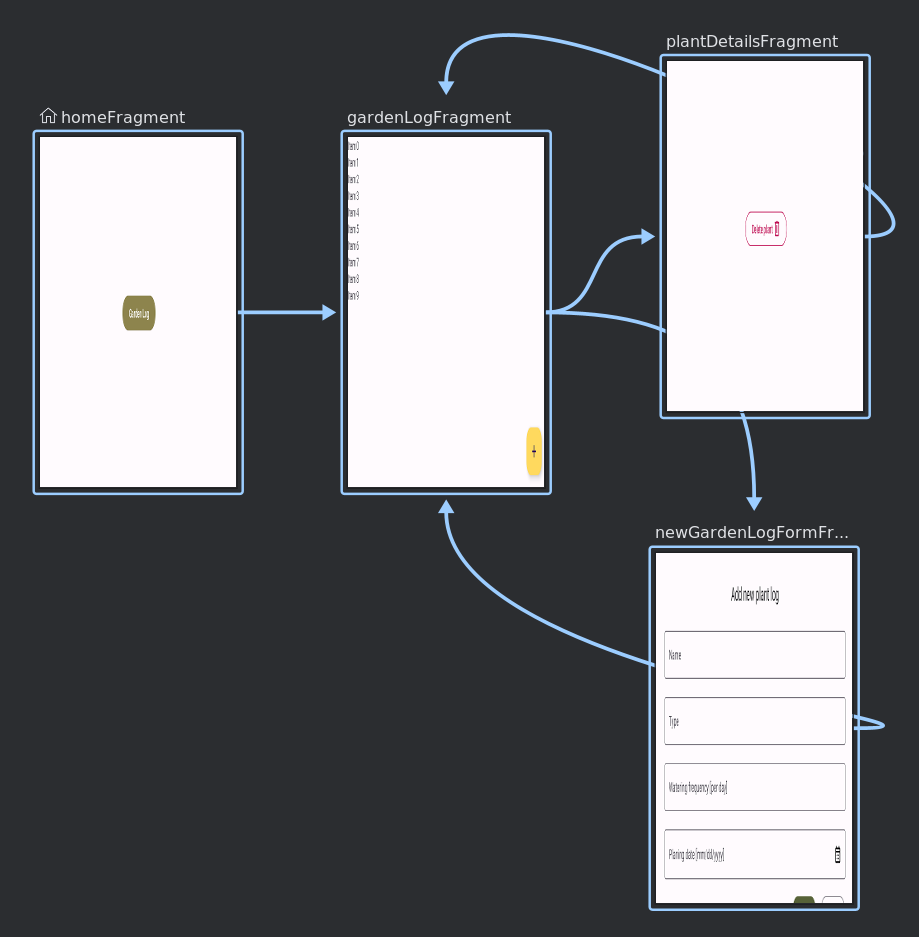
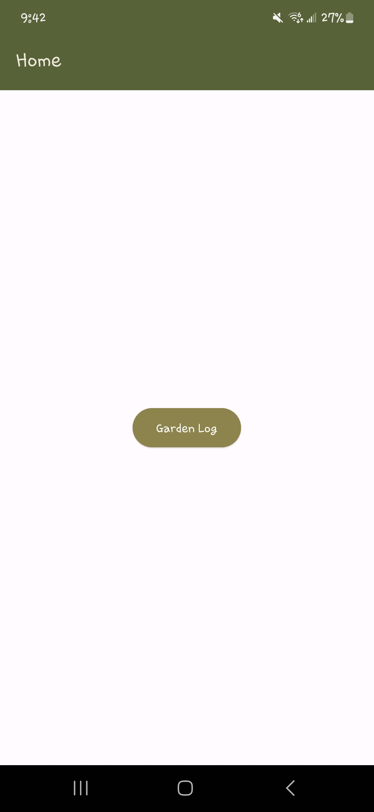
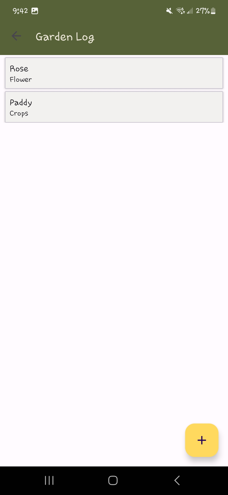
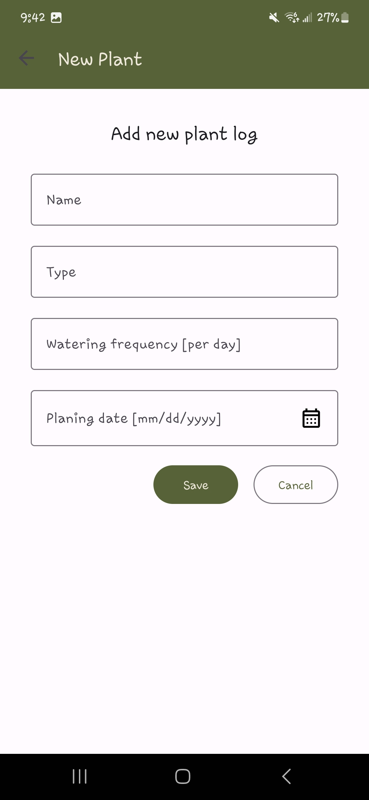
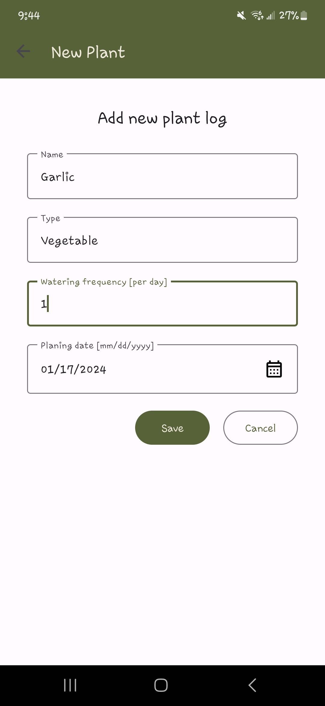
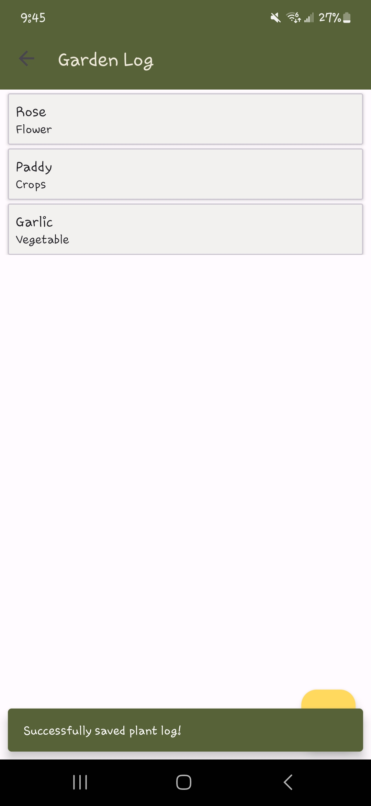
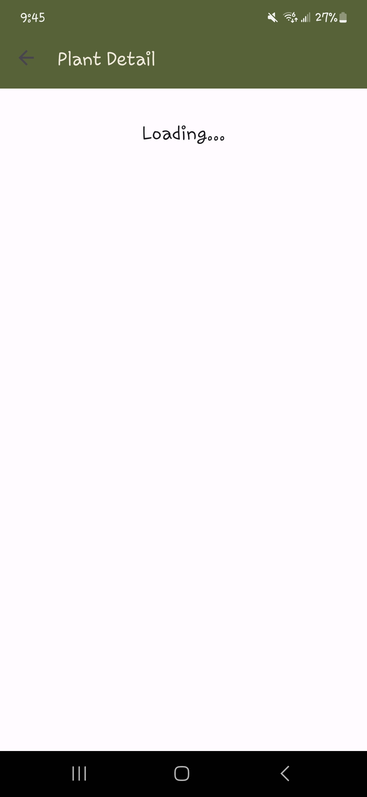
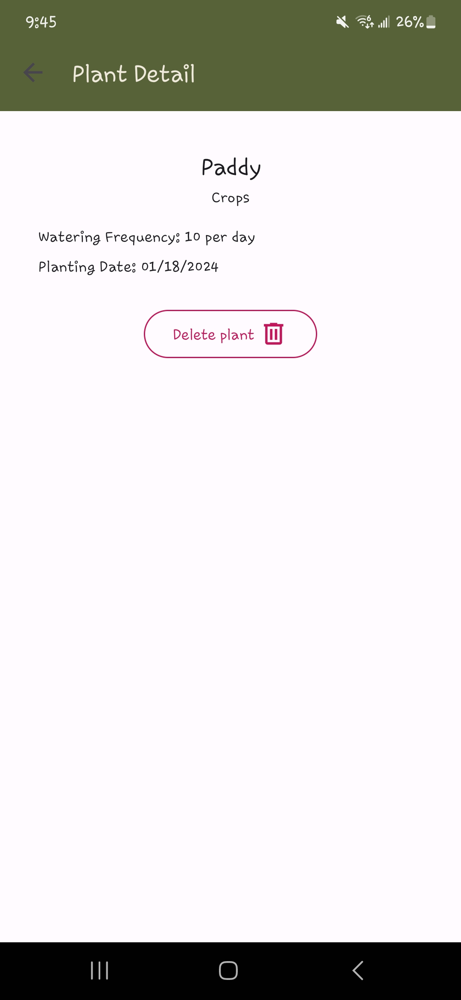
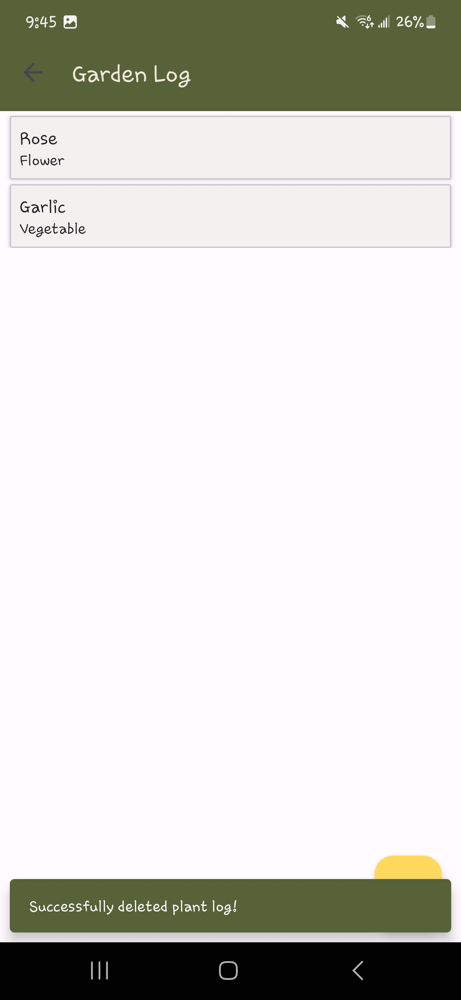

# Gardening Journal
This application allows users to add different plants and information about them.

The purpose of this android application is to demonstrate the implementation of 
- different Android Jetpack components:
  - Navigation
  - Room Database
  - View Model
  - LiveData
- Coroutine concepts to run background tasks without blocking main thread

## Application Architecture
### Navigation
In this application the Navigation component is used to arrange the flow among different fragments:
- Home: Starting fragment
- GardenLog: Plant listing fragment
- NewGardenLog: New Plant creation fragment with a form
- PlantDetail: Fragment to display plant detail by plant-id

#### Navigation Graph


The main activity holds the default `NavHostFragment`, within which the navigation happens. The navigation controller is bound to the app bar for navigation-up. Navigation Up or Back is used to traverse back in the backStack, created when a navigation happens. 

Action is used to navigate from one fragment to another. For an example, in the Home fragment, when the `Garden Log` button is clicked, an action defined in the navigation graph is used to navigate to GardenLog fragment.
<table>
<tbody>
<tr>
<td></td>
<td></td>
</tr>
</tbody>
</table>

User can add a new plant by clicking on the FAB button in the GardenLog fragment, which navigates the user to the newPlantFormFragment.
<table>
<tbody>
<tr>
<td></td>
<td></td>
</tr>
</tbody>
</table>

When the save is successful or the user cancels manually from the NewPlantForm fragment, user is navigated back to GardenLog.
<table>
<tbody>
<tr>
<td></td>
<td></td>
</tr>
</tbody>
</table>

There is a circular navigation happening here, and that has been resolved by using `popUpTo` along with `inclusive` attributes in the corresponding action, which clears the fragments stored in the backstack up to the point defined by `popUpTo` [in this case GardenLog].
```xml
<fragment
    android:id="@+id/newGardenLogFormFragment"
    android:name="edu.miu.cs473de.lab6.gardeningjournal.ui.fragments.NewGardenLogFormFragment"
    android:label="New Plant"
    tools:layout="@layout/fragment_new_garden_log_form">
    <action
        android:id="@+id/action_newGardenLogFormFragment_to_gardenLogFragment"
        app:destination="@id/gardenLogFragment"
        app:popUpTo="@id/gardenLogFragment"
        app:popUpToInclusive="true"/>
</fragment>
```

There is one action in the app where data is passed as argument, that action is the one which helps navigation from GardenLog Fragment to PlantDetails fragment, and the data passed as an argument is the id of any plant listed in the GardenLog. 
<table>
<tbody>
<tr>
<td></td>
<td></td>
</tr>
</tbody>
</table>

When the user deletes the plant in the PlantDetail fragment, user is navigated back to GardenLog. Here also, the circular navigation is resovled using similar approach as above.
<table>
<tbody>
<tr>
<td></td>
<td></td>
</tr>
</tbody>
</table>

### Gardenlog Database [Room]
The plants are stored in the Room database and the only existing entity is `Plant` entity. 

GardenLogDatabase is configured to provide singleton and synchronized instance of database object. PlantDao is the class where different CRUD queries are defined.

### Fragment state persistence with ViewModel and LiveData
ViewModel has been used to persist or save the state of fragments so that they will survive the configuration change like screen rotation.

#### Home fragment
No view model associated as there is no state needed to be persisted.

#### GardenLog fragment
A view model that extends `AndroidViewModel` (child of `ViewModel`) is associated with GardenLog fragment. That view-model holds a reference to a `LiveData` reference returned by `PlantDao.getPlants()` method, and is observed for change. Such that, whenever a change is detected in the `LiveData` object the recycler view is updated. This helps to synchronize the Room database change with the UI representation.

### PlantDetail fragment
This fragment also associates a view-model which contains a `MutableLiveData` reference to a Plant object, which is populated with the result from database query to find plant by plantId [obtained as an argument to navigation action from GardenLog].

### NewPlantForm fragment
This fragment also does not have any viewmodel associated. The data in the `EditText` fields are preserved automatically if unique IDs are provided to corresponding `EditText` views and the fragment's container view.

### Coroutine
In this app, there is a `BaseFragment` class that extends `Fragment` and implements `CoroutineScope` interface. This is to centralize the `Job` management: creating a coroutine job in `onCreate` and canceling in `onDestroy` lifecycle methods, such that any Fragment that wants to run some non-blocking coroutines can just extend this `BaseFragment` class and use the inherited coroutine scope.

GardenLog, PlantDetail, and NewPlantForm fragments extend the `BaseFragment` and use the inherited coroutine scope for database access.

## Build and Run
Clone the project
```shell
git clone https://github.com/mrranjan31paudel/miu-cs473de-mdp-assignments.git
```
Open the `GardeningJournal` project with Android studio. You can then build and launch the app either with AVD or connect your Android phone.

For testing with an Android phone you should first enable `Developer Options` and then
- either enable Wireless-Debugging for wireless connection
- or enable USB-Debugging for USB connection