
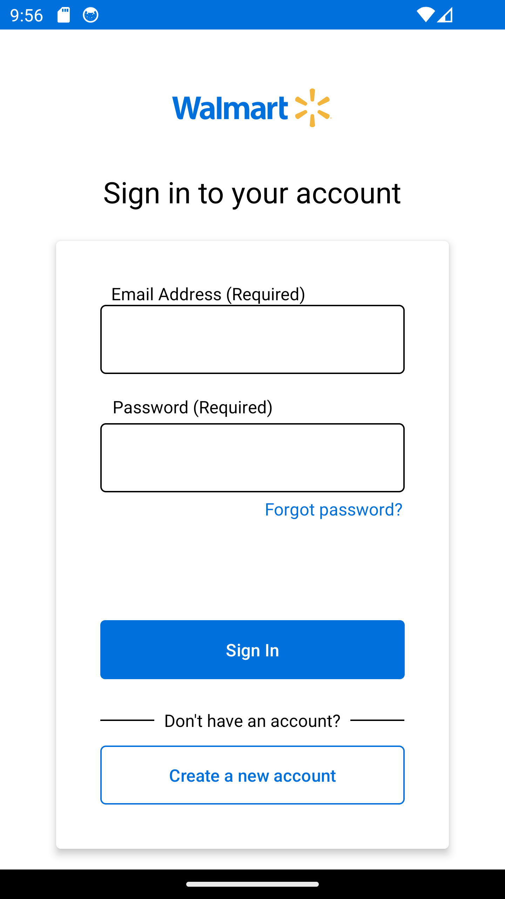 <em>Fig 1: Sign In Screen</em>

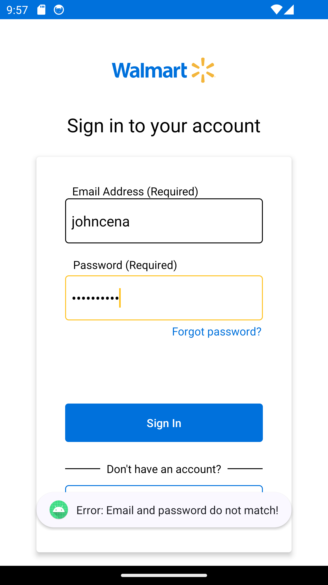 <em>Fig 2: Email and password validation showing the validation error</em>

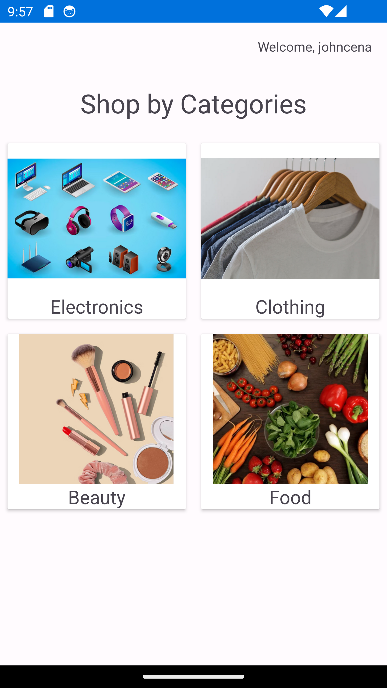 <em>Fig 3: User taken to dash board after successful sign in by entering right email and password</em>

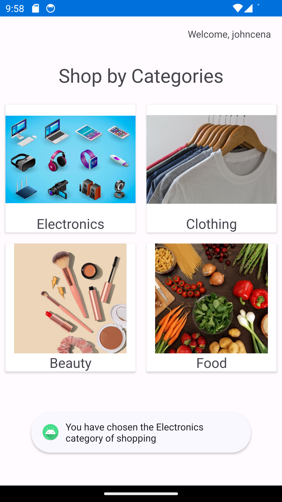 <em>Fig 4: Toast message to indicate category selection by clicking</em>

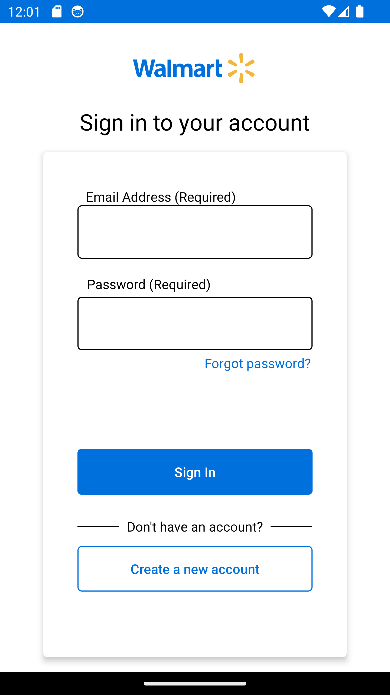 <em>Fig 5: Back to sign in screen/activity</em>

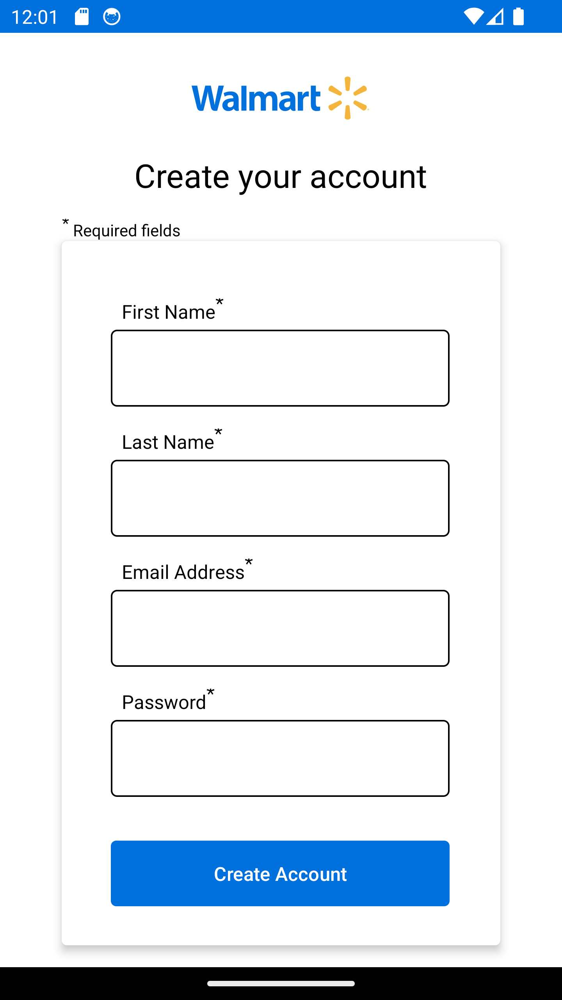 <em>Fig 6: User taken to create new account screen after clicking <code>Create new account</code> button</em>

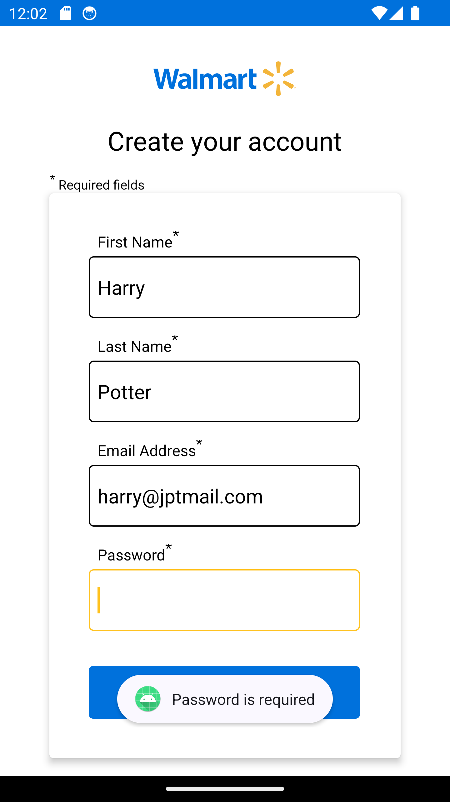 <em>Fig 7: Validating the required <code>Password</code> field</em>

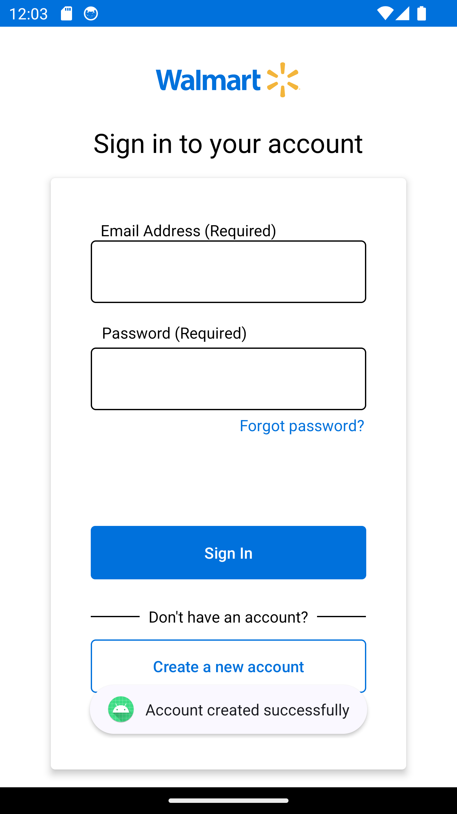 <em>Fig 8: User taken back to sign in screen after successful account creation after entering all the required inputs</em>

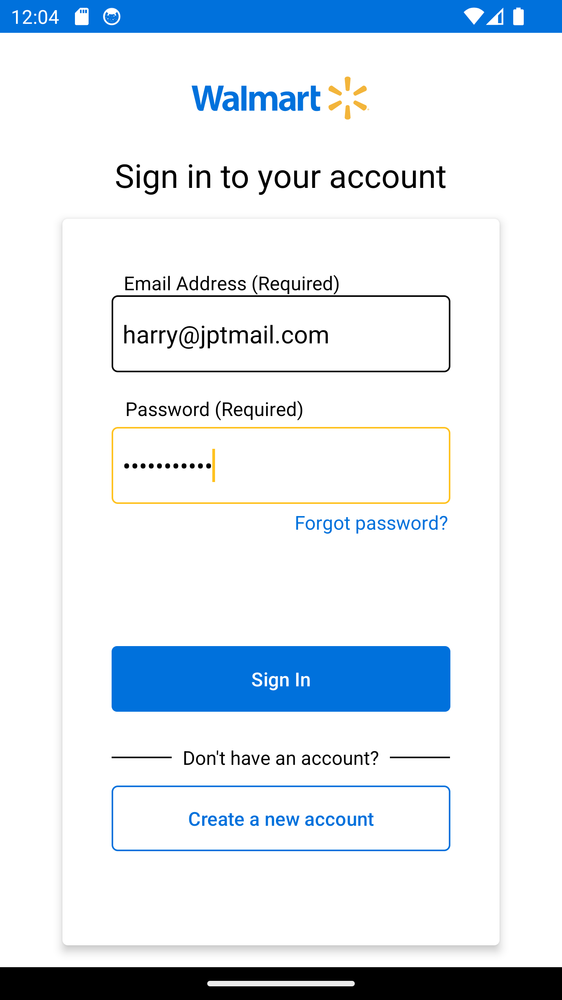 <em>Fig 9: User entering newly created account credential</em>

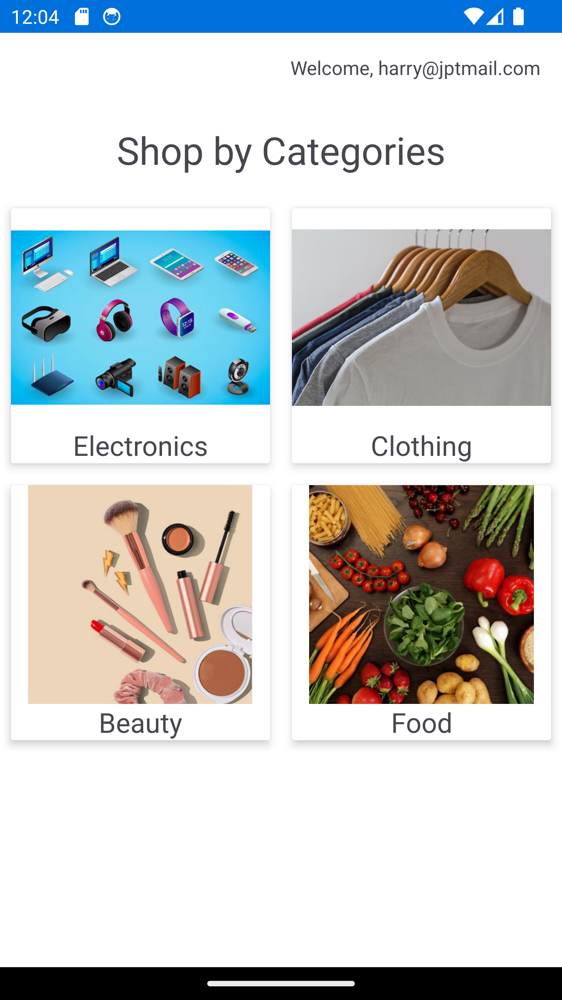 <em>Fig 10: User successfully signed in with newly created account</em>

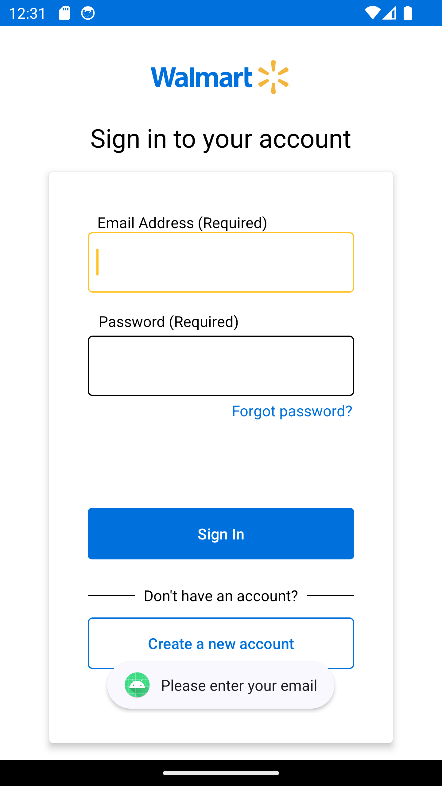 <em>Fig 11: User clicking forgot password link without entering email and getting the error toast message</em>

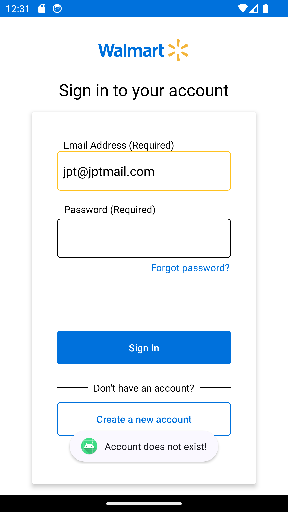 <em>Fig 12: Error shown for click on Forgot password with non-existing email address</em>

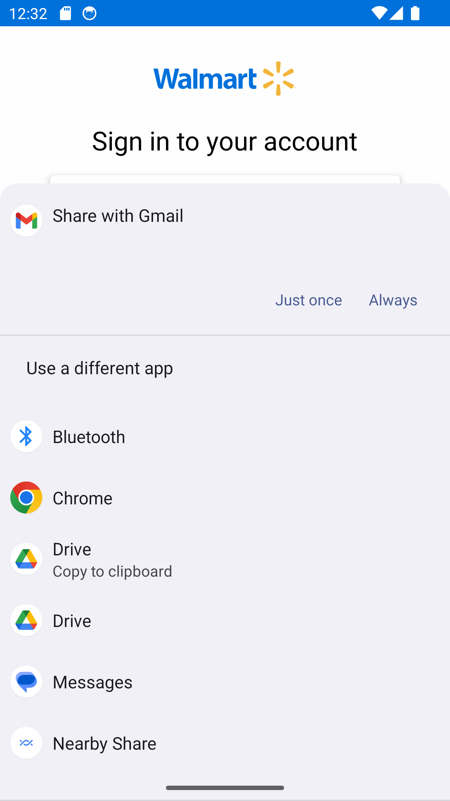 <em>Fig 13: User presented with options to send email/message due to implicit intent</em>